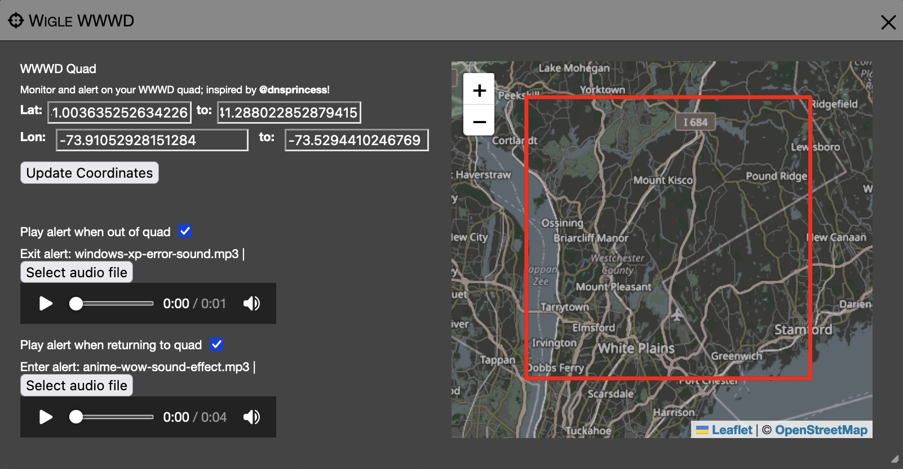

# Wigle World Wide War Drive Plugin

A simple web-only plugin for Kismet, inspired by [@dnsprincess](https://infosec.exchange/@dnsprincess)'s [WWWD Planner](https://github.com/your-dnsp/WiGLE-Warpath-Planner).

Don't know what the World Wide War Drive is?  Hit up the [Wigle.net](https://wigle.net/contest/DC32) announcement, grab Kismet, or a phone, or an ESP32 even, and join!



## Installing

### Installing in the user plugin directory

The easiest way to install the plugin is to drop it into the `~/.kismet/plugins/` directory of the user you run Kismet as:

```bash
cd ~/.kismet/
mkdir plugins
cd plugins
git clone https://github.com/kismetwireless/kismet-plugin-wiglequad.git wiglequad
```

You will need to restart Kismet.

### Using the plugin 

The first time you log into the Kismet web UI after installing the plugin, it will automatically open the plugin configuration window.

You can get to this window at any time using the `WWWD` text in the title bar, or the `WWWD` menu option in the left-hand hamburger menu.

1. Copy your quad from the WWWD into the coordinate fields.
2. Select audio files for leaving and entering your quad.  MP3 and WAV should work fine.
3. Wardrive!
4. Profit!

### What it does

While you are out of your WWWD quad, Kismet will play your exit noise every 10 seconds.  I suggest uploading a file that is shorter than 10 seconds (or embrace the chaos).

When you re-enter your WWWD quad, Kismet will play the entrance noise.

### Browser permissions

The plugin needs permissions to play sound in the background.  You may need to allow audio permissions for your Kismet server in your browser preferences.

### Settings

Settings and audio files are stored in your browser local storage.  If you clear your browser session, or switch browsers, you will need to configure them again.

